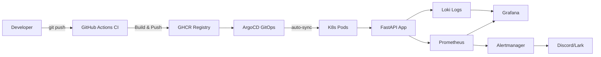
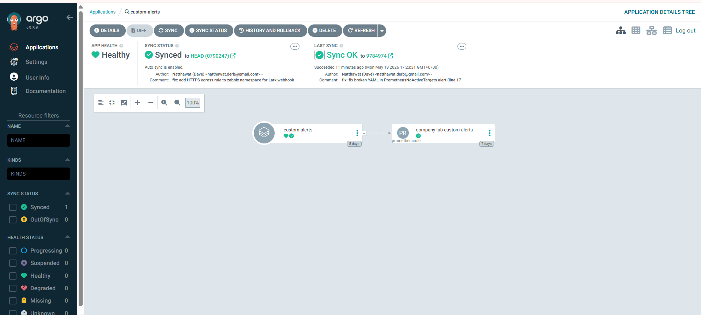
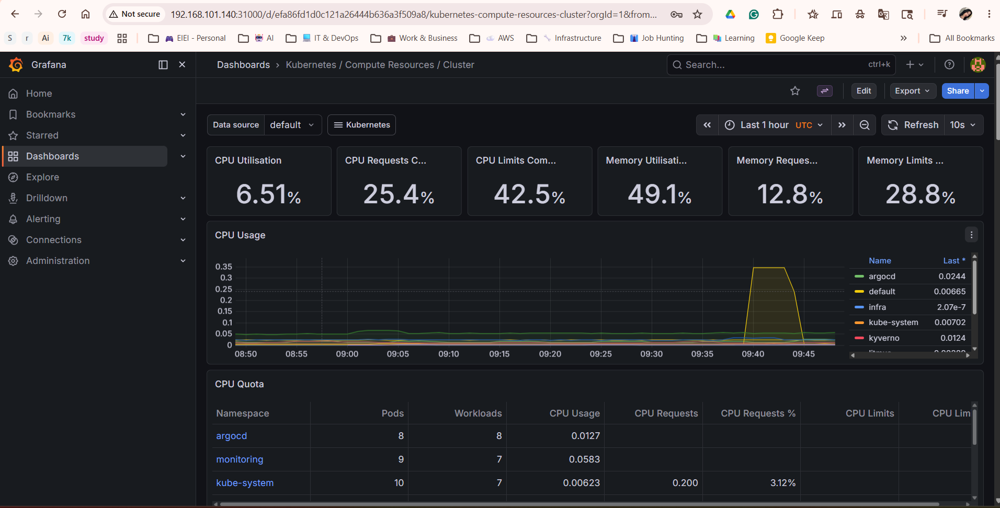
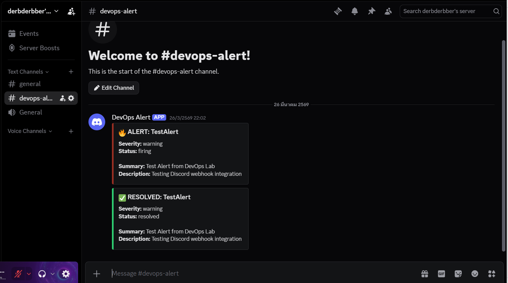
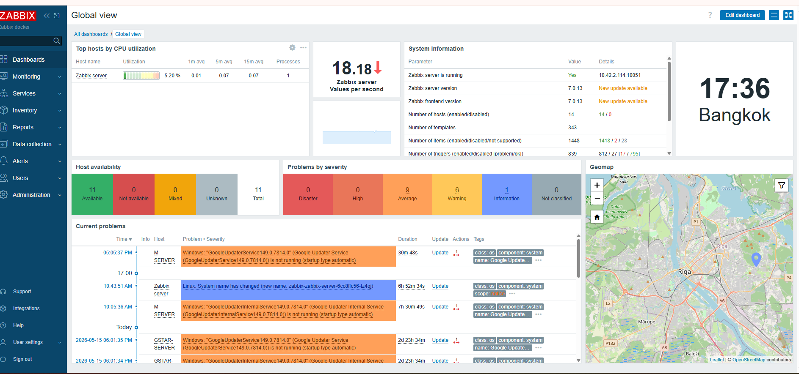
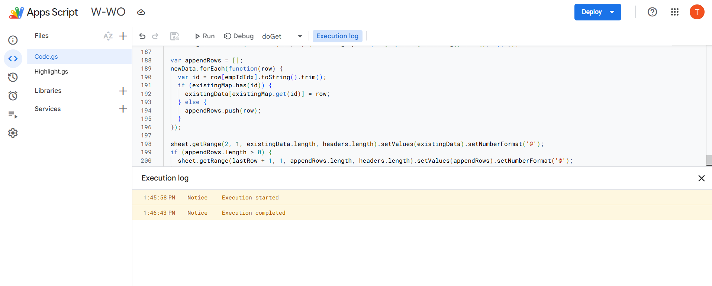
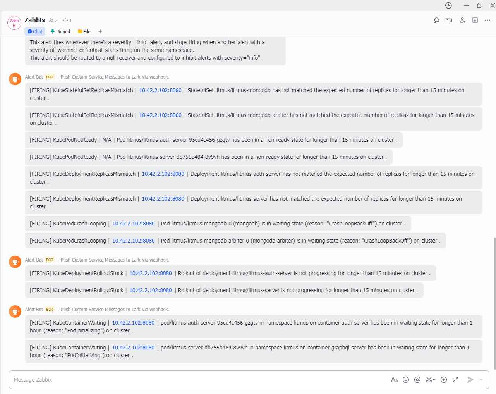

# DevOps FastAPI Lab 🚀

[](https://github.com/DerbSwag/Devops-fastapi-lab/actions/workflows/docker.yml)
[](https://opensource.org/licenses/MIT)

Production-style DevOps lab using FastAPI, Docker, Kubernetes (k3s), ArgoCD GitOps, and full observability stack.

## Quick Start

```bash
git clone https://github.com/DerbSwag/Devops-fastapi-lab.git
cd Devops-fastapi-lab
cp .env.example .env
docker compose -f compose/app.yml up -d
```

> For full Kubernetes deployment, see [docs/getting-started.md](docs/getting-started.md)

---

## 📈 Key Results

| Metric | Value |
|--------|-------|
| Kubernetes levels completed | 8 / 8 |
| HPA auto-scaling verified | 1 → 6 pods (199% CPU spike) |
| GitOps | ArgoCD auto-sync + self-heal |
| CI/CD pipeline | Push → Build → GHCR → Deploy in <3 min |
| Observability | Prometheus + Grafana + Loki + Alertmanager |
| Environments | Home Lab (k3s) + Company Lab (Proxmox 3-node) |

---

## Architecture



### CI/CD Flow

```
git push → GitHub Actions → Build Docker image → Push to GHCR
                                                      │
              Docker Compose (Home Lab)     ArgoCD detects Helm drift
                       │                              │
              FastAPI + Nginx running      auto-sync → K8s pods updated
                                           (zero-downtime rolling update)
```

### Monitoring & Observability

```
Application → Prometheus → Grafana (dashboards)
                  │
K8s Nodes ──→ Alertmanager → Discord / Lark (alerts)

App Logs ───→ Loki ────────→ Grafana (log search)
```

---

## Tech Stack

| Category | Tools |
|----------|-------|
| Application | FastAPI, Python |
| Containers | Docker, Docker Compose, GHCR |
| Orchestration | Kubernetes (k3s), Helm |
| GitOps & CD | ArgoCD, GitHub Actions + Self-hosted Runner |
| Networking | Nginx Ingress Controller, cert-manager, Traefik |
| Observability | Prometheus, Grafana, Loki, Alertmanager, Node Exporter, cAdvisor |

---

## Learning Roadmap

| Level | Topic | Highlights |
|-------|-------|------------|
| 1 | Docker & CI/CD | Containerization, GitHub Actions, GHCR |
| 2 | Kubernetes & Helm | k3s cluster, Helm chart, ConfigMap/Secrets |
| 3 | GitOps & Monitoring | ArgoCD auto-sync, Prometheus stack, Discord alerts |
| 4 | Advanced K8s | Nginx Ingress, NetworkPolicy, HPA (1→5 pods) |
| 5 | StatefulSet & RBAC | PostgreSQL StatefulSet, RBAC, multi-env Helm |
| 6 | TLS | cert-manager, self-signed ClusterIssuer, multi-service HTTPS |
| 7 | Stress Testing | HPA verified: 1→6 pods at 199% CPU |
| 8 | Logging | Loki + Promtail + Grafana integration |

> Detailed level-by-level walkthrough → [docs/roadmap.md](docs/roadmap.md)

---

## Project Structure

```
.
├── app/                    # FastAPI application
├── docker/                 # Dockerfile
├── compose/                # Docker Compose files (app + monitoring)
├── helm/fastapi/           # Helm chart (ArgoCD source)
├── k8s/                    # Kubernetes manifests by level
│   ├── level4-ingress-hpa/
│   ├── level5-statefulset/
│   └── level8-loki/
├── monitoring/             # Prometheus, Grafana, Alertmanager configs
├── nginx/                  # Reverse proxy config
├── scripts/                # Setup & deploy scripts
└── .github/workflows/      # CI/CD pipeline
```

---

## Service URLs (Local Lab)

| Service | URL |
|---------|-----|
| FastAPI (Docker) | http://localhost:8000 |
| FastAPI (K8s Ingress) | http://fastapi.local:30080 |
| Prometheus | http://localhost:9090 |
| Grafana | http://localhost:3000 |
| Alertmanager | http://localhost:9093 |
| ArgoCD | https://\<VM_IP\>:8888 |

> ⚠️ All URLs are for local lab use only. Do not expose without proper authentication.

---

## Monitoring & Alerting

| Alert | Condition | Severity |
|-------|-----------|----------|
| HighCPUUsage | CPU > 80% for 1m | warning |
| HighMemoryUsage | RAM > 85% for 1m | warning |
| DiskSpaceLow | Disk > 80% for 1m | critical |
| InstanceDown | Service down for 1m | critical |
| ContainerHighCPU | Container CPU > 80% | warning |

Alerts → Discord via Alertmanager webhook (`DISCORD_WEBHOOK_URL` env var).

---

## Screenshots

| ArgoCD GitOps | Grafana Dashboard |
|:---:|:---:|
|  |  |

| Discord Alert | HPA Auto-scaling |
|:---:|:---:|
|  |  |

| Zabbix Monitoring (14 hosts) | Proxmox Cluster |
|:---:|:---:|
|  |  |

| Alertmanager → Lark |
|:---:|
|  |

---


## Documentation

| Doc | Description |
|-----|-------------|
| [Getting Started](docs/getting-started.md) | Full setup guide — Docker & Kubernetes |
| [Learning Roadmap](docs/roadmap.md) | Detailed level-by-level walkthrough |

---

## Security Notes

- Secrets loaded from environment variables, never hardcoded
- K8s secrets created via `kubectl create secret` — templates use placeholders only
- Real secret files (`*secret-real.yaml`, `*.env`) excluded via `.gitignore`

---

## License

MIT
