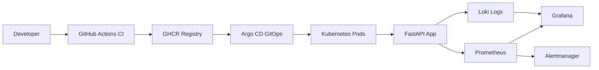

# DevOps FastAPI Home Lab

[](https://github.com/DerbSwag/Devops-fastapi-lab/actions/workflows/docker.yml)
[](https://opensource.org/licenses/MIT)

Application delivery lab for FastAPI, Docker, Kubernetes, Helm, GitHub Actions, GitOps, monitoring, and incident documentation.

This repository is designed as a learning and portfolio project. It shows the application side of a DevOps workflow: build an API, containerize it, test it, publish an image, deploy it to Kubernetes, observe it, and document operational behavior.

---

## Quick Start

```bash
git clone https://github.com/DerbSwag/Devops-fastapi-lab.git
cd Devops-fastapi-lab
cp .env.example .env
docker compose -f compose/app.yml up -d
```

For full Kubernetes deployment, see [docs/getting-started.md](docs/getting-started.md).

---

## What This Lab Demonstrates

- FastAPI application development and health endpoints.
- Docker image build and Docker Compose runtime.
- GitHub Actions CI/CD with GHCR image publishing.
- Container vulnerability scanning with Trivy.
- Kubernetes manifests, Services, Ingress, probes, and HPA.
- Helm chart packaging for repeatable deployments.
- Argo CD GitOps sync and self-healing workflow.
- Prometheus, Grafana, Loki, and Alertmanager observability.
- Backup notes, incident docs, and progressive learning levels.

---

## Key Results

| Metric | Value |
| --- | --- |
| Kubernetes levels completed | 8 / 8 |
| HPA auto-scaling verified | 1 to 6 pods under CPU load |
| GitOps | Argo CD auto-sync and self-heal |
| CI/CD pipeline | Push to build to GHCR to deploy |
| Observability | Prometheus, Grafana, Loki, Alertmanager |
| Environments | Local Docker lab and k3s Kubernetes lab |

---

## Architecture



CI/CD flow:

```text
git push
  -> GitHub Actions
  -> build Docker image
  -> push to GHCR
  -> Argo CD reconciles Kubernetes
  -> rolling update completes
```

Observability flow:

```text
Application metrics -> Prometheus -> Grafana dashboards
Application logs    -> Loki       -> Grafana log search
Alerts              -> Alertmanager / webhook receiver
```

---

## Tech Stack

| Category | Tools |
| --- | --- |
| Application | FastAPI, Python |
| Containers | Docker, Docker Compose, GHCR |
| CI/CD | GitHub Actions |
| Orchestration | Kubernetes, k3s, Helm |
| GitOps | Argo CD |
| Networking | Nginx Ingress Controller, cert-manager, Traefik |
| Observability | Prometheus, Grafana, Loki, Alertmanager, Node Exporter, cAdvisor |

---

## Learning Roadmap

| Level | Topic | Highlights |
| --- | --- | --- |
| 1 | Docker and CI/CD | Containerization, GitHub Actions, GHCR |
| 2 | Kubernetes and Helm | k3s cluster, Helm chart, ConfigMap, Secret |
| 3 | GitOps and Monitoring | Argo CD auto-sync, Prometheus stack, alert routing |
| 4 | Advanced Kubernetes | Ingress, NetworkPolicy, HPA |
| 5 | StatefulSet and RBAC | PostgreSQL StatefulSet, RBAC, multi-env Helm |
| 6 | TLS | cert-manager, self-signed ClusterIssuer, HTTPS |
| 7 | Stress Testing | HPA verified under CPU load |
| 8 | Logging | Loki, Promtail, Grafana log search |

Detailed level-by-level walkthrough: [docs/roadmap.md](docs/roadmap.md)

---

## Project Structure

```text
.
├── app/                    # FastAPI application
├── compose/                # Docker Compose files
├── docker/                 # Dockerfile
├── helm/fastapi/           # Helm chart
├── k8s/                    # Kubernetes manifests by level
├── monitoring/             # Prometheus, Grafana, Alertmanager configs
├── nginx/                  # Reverse proxy config
├── scripts/                # Setup and deploy scripts
├── tests/                  # Application tests
└── .github/workflows/      # CI/CD pipelines
```

---

## Service URLs

| Service | URL |
| --- | --- |
| FastAPI with Docker | `http://localhost:8000` |
| FastAPI through Kubernetes Ingress | `http://fastapi.local:30080` |
| Prometheus | `http://localhost:9090` |
| Grafana | `http://localhost:3000` |
| Alertmanager | `http://localhost:9093` |
| Argo CD | `https://<VM_IP>:8888` |

These URLs are for local lab use only. Do not expose them without proper authentication and network controls.

---

## Monitoring & Alerting

| Alert | Condition | Severity |
| --- | --- | --- |
| HighCPUUsage | CPU over threshold | warning |
| HighMemoryUsage | memory over threshold | warning |
| DiskSpaceLow | disk usage over threshold | critical |
| InstanceDown | service unavailable | critical |
| ContainerHighCPU | container CPU over threshold | warning |

Webhook integrations use environment variables such as `DISCORD_WEBHOOK_URL`. Real webhook URLs are not committed.

---

## Screenshots

| Argo CD GitOps | Grafana Dashboard |
| --- | --- |
|  |  |

| Discord Alert | HPA Auto-scaling |
| --- | --- |
|  |  |

| Zabbix Monitoring | Proxmox Cluster |
| --- | --- |
|  |  |

| Alertmanager to Lark |
| --- |
|  |

---

## Documentation

| Doc | Description |
| --- | --- |
| [Getting Started](docs/getting-started.md) | Docker and Kubernetes setup guide |
| [Learning Roadmap](docs/roadmap.md) | Detailed level-by-level walkthrough |
| [Runbook](RUNBOOK.md) | Operational troubleshooting notes |
| [Incidents](INCIDENTS.md) | Public-safe incident summaries |

---

## Security Notes

- Secrets are loaded from environment variables, CI/CD secrets, or local override files.
- Kubernetes secret templates use placeholders only.
- Real secret files, real `.env` files, and local override values are excluded through `.gitignore`.
- This repo is for lab and portfolio use, not direct production deployment.

---

## License

MIT

