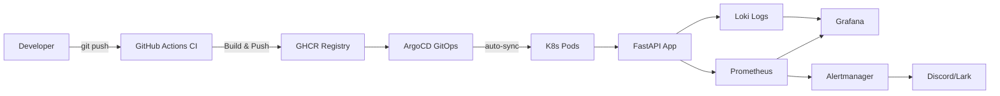
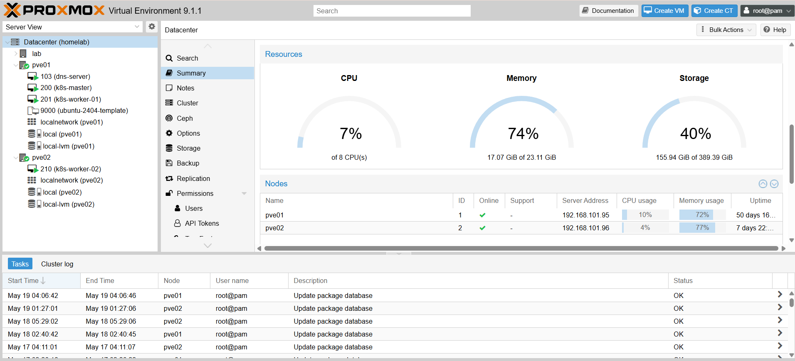
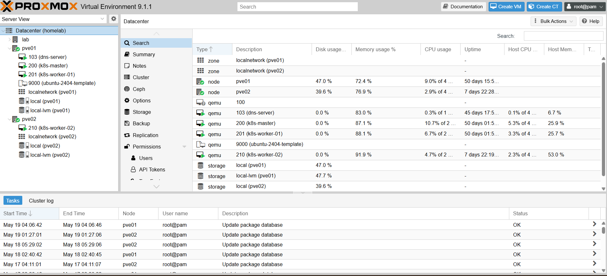

# DevOps FastAPI Lab 🚀

[](https://github.com/DerbSwag/Devops-fastapi-lab/actions/workflows/docker.yml)
[](https://opensource.org/licenses/MIT)

Production-style **home lab and portfolio project** using FastAPI, Docker, Kubernetes (k3s), ArgoCD GitOps, and a full observability stack.

This repository documents an end-to-end DevOps learning environment: application delivery, container builds, GitOps deployment, Kubernetes operations, monitoring, logging, alerting, and incident-style documentation.

## Home Lab Scope

This project is a personal DevOps home lab designed to simulate real production workflows in a controlled environment. Some defaults are intentionally simplified for learning, demos, and local infrastructure constraints:

- Demo/local values may use lab-only domains such as `fastapi.local`.
- Some manifests include placeholder or demo credentials for reproducible exercises.
- Local Docker Compose deployments may use the `latest` image tag for convenience.
- TLS, ingress, alerting, and secret management examples are intended to show implementation patterns, not turnkey production policy.

For production use, replace lab shortcuts with hardened controls such as external secret management, immutable image tags, policy enforcement, stricter CI gates, and environment-specific security baselines.

---

## Portfolio Highlights

- Built a full CI/CD path from GitHub Actions to GHCR and local/home-lab deployment.
- Deployed FastAPI to Kubernetes with Helm and GitOps workflows.
- Practiced progressive Kubernetes operations: ingress, HPA, StatefulSet, RBAC, TLS, service mesh, policy, backup, and chaos engineering topics.
- Integrated observability with Prometheus, Grafana, Loki, Alertmanager, Discord/Lark notifications, and dashboard evidence.
- Documented operational learning through runbooks, incident notes, screenshots, and a level-based roadmap.

## Quick Start

```bash
git clone https://github.com/DerbSwag/Devops-fastapi-lab.git
cd Devops-fastapi-lab
cp .env.example .env
docker compose -f compose/app.yml up -d
```

> For full Kubernetes deployment, see [docs/getting-started.md](docs/getting-started.md)

---

## 📈 Key Results

| Metric | Value |
|--------|-------|
| Kubernetes levels completed | 8 / 8 |
| HPA auto-scaling verified | 1 → 6 pods (199% CPU spike) |
| GitOps | ArgoCD auto-sync + self-heal |
| CI/CD pipeline | Push → Build → GHCR → Deploy in <3 min |
| Observability | Prometheus + Grafana + Loki + Alertmanager |
| Environments | Home Lab (k3s) + Company Lab (Proxmox 3-node) |

---

## Architecture



### CI/CD Flow

```
git push → GitHub Actions → Build Docker image → Push to GHCR
                                                      │
              Docker Compose (Home Lab)     ArgoCD detects Helm drift
                       │                              │
              FastAPI + Nginx running      auto-sync → K8s pods updated
                                           (zero-downtime rolling update)
```

### Monitoring & Observability

```
Application → Prometheus → Grafana (dashboards)
                  │
K8s Nodes ──→ Alertmanager → Discord / Lark (alerts)

App Logs ───→ Loki ────────→ Grafana (log search)
```

---

## Tech Stack

| Category | Tools |
|----------|-------|
| Application | FastAPI, Python |
| Containers | Docker, Docker Compose, GHCR |
| Orchestration | Kubernetes (k3s), Helm |
| GitOps & CD | ArgoCD, GitHub Actions + Self-hosted Runner |
| Networking | Nginx Ingress Controller, cert-manager, Traefik |
| Observability | Prometheus, Grafana, Loki, Alertmanager, Node Exporter, cAdvisor |

---

## Learning Roadmap

| Level | Topic | Highlights |
|-------|-------|------------|
| 1 | Docker & CI/CD | Containerization, GitHub Actions, GHCR |
| 2 | Kubernetes & Helm | k3s cluster, Helm chart, ConfigMap/Secrets |
| 3 | GitOps & Monitoring | ArgoCD auto-sync, Prometheus stack, Discord alerts |
| 4 | Advanced K8s | Nginx Ingress, NetworkPolicy, HPA (1→5 pods) |
| 5 | StatefulSet & RBAC | PostgreSQL StatefulSet, RBAC, multi-env Helm |
| 6 | TLS | cert-manager, self-signed ClusterIssuer, multi-service HTTPS |
| 7 | Stress Testing | HPA verified: 1→6 pods at 199% CPU |
| 8 | Logging | Loki + Promtail + Grafana integration |

> Detailed level-by-level walkthrough → [docs/roadmap.md](docs/roadmap.md)

---

## Project Structure

```
.
├── app/                    # FastAPI application
├── docker/                 # Dockerfile
├── compose/                # Docker Compose files (app + monitoring)
├── helm/fastapi/           # Helm chart (ArgoCD source)
├── k8s/                    # Kubernetes manifests by level
│   ├── level4-ingress-hpa/
│   ├── level5-statefulset/
│   └── level8-loki/
├── monitoring/             # Prometheus, Grafana, Alertmanager configs
├── nginx/                  # Reverse proxy config
├── scripts/                # Setup & deploy scripts
└── .github/workflows/      # CI/CD pipeline
```

---

## Service URLs (Local Lab)

| Service | URL |
|---------|-----|
| FastAPI (Docker) | http://localhost:8000 |
| FastAPI (K8s Ingress) | http://fastapi.local:30080 |
| Prometheus | http://localhost:9090 |
| Grafana | http://localhost:3000 |
| Alertmanager | http://localhost:9093 |
| ArgoCD | https://\<VM_IP\>:8888 |

> ⚠️ All URLs are for local lab use only. Do not expose without proper authentication.

---

## Monitoring & Alerting

| Alert | Condition | Severity |
|-------|-----------|----------|
| HighCPUUsage | CPU > 80% for 1m | warning |
| HighMemoryUsage | RAM > 85% for 1m | warning |
| DiskSpaceLow | Disk > 80% for 1m | critical |
| InstanceDown | Service down for 1m | critical |
| ContainerHighCPU | Container CPU > 80% | warning |

Alerts → Discord via Alertmanager webhook (`DISCORD_WEBHOOK_URL` env var).

---

## Screenshots

| ArgoCD GitOps | Grafana Dashboard |
|:---:|:---:|
|  |  |

| Discord Alert | HPA Auto-scaling |
|:---:|:---:|
|  |  |

| Zabbix Monitoring (14 hosts) | Proxmox Cluster |
|:---:|:---:|
|  |  |


| Proxmox Summary | Proxmox VMs |
|:---:|:---:|
|  |  |


| Alertmanager → Lark |
|:---:|
|  |

---


## Documentation

| Doc | Description |
|-----|-------------|
| [Getting Started](docs/getting-started.md) | Full setup guide — Docker & Kubernetes |
| [Learning Roadmap](docs/roadmap.md) | Detailed level-by-level walkthrough |

---

## Security Notes

- Secrets loaded from environment variables, never hardcoded
- K8s secrets created via `kubectl create secret` — templates use placeholders only
- Real secret files (`*secret-real.yaml`, `*.env`) excluded via `.gitignore`

> Note: values committed for lab reproducibility must be treated as demo-only. Do not store real production credentials in Git.

---

## Production Hardening Checklist

Use this checklist when promoting the lab patterns toward a real production environment.

### Secrets & Configuration

- [ ] Replace demo secrets with External Secrets Operator, SOPS, SealedSecrets, Vault, or a cloud secret manager.
- [ ] Remove all real credentials from Git history and rotate anything that was ever committed.
- [ ] Split default, development, staging, and production values clearly.
- [ ] Validate required environment variables at application startup.

### CI/CD & Supply Chain

- [ ] Run unit tests and lint checks before building container images.
- [ ] Fail the pipeline on critical/high vulnerability findings where appropriate.
- [ ] Deploy immutable image tags or digests instead of relying on `latest`.
- [ ] Generate SBOMs and keep image scan results as build artifacts.
- [ ] Add branch/environment protection for production deployments.

### Container & Kubernetes Runtime

- [ ] Run containers as non-root users.
- [ ] Set `runAsNonRoot`, `allowPrivilegeEscalation: false`, dropped Linux capabilities, and read-only root filesystems where possible.
- [ ] Add NetworkPolicies for application, database, ingress, and monitoring traffic.
- [ ] Add PodDisruptionBudgets for workloads that need high availability.
- [ ] Move HPA configuration into Helm values for consistent environment promotion.

### Observability & Reliability

- [ ] Expose application metrics and scrape them with Prometheus.
- [ ] Alert on user-impacting symptoms such as 5xx rate, latency, readiness failures, and unavailable replicas.
- [ ] Define basic SLOs for availability and latency.
- [ ] Add dashboard panels for request rate, error rate, latency, pod restarts, and DB connectivity.
- [ ] Keep runbooks linked from alerts.

### Backup, Recovery & Operations

- [ ] Test restore procedures for stateful services, not only backup creation.
- [ ] Document rollback steps for Docker Compose, Helm, and ArgoCD paths.
- [ ] Add disaster-recovery notes for node loss, registry outage, and database failure.
- [ ] Periodically review resource requests, limits, and capacity headroom.

---

## License

MIT
